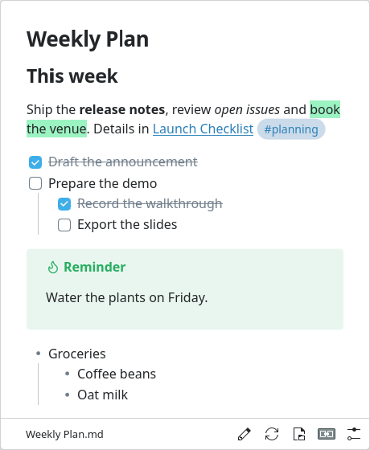
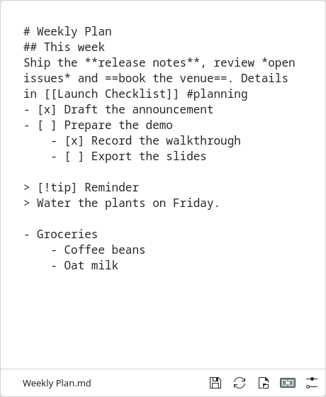
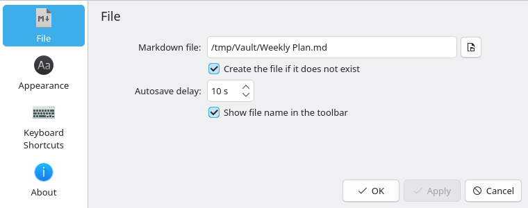
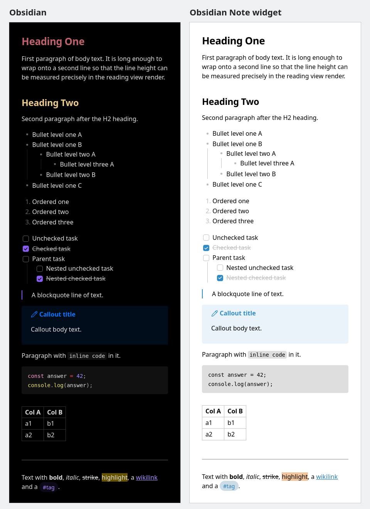

# Obsidian Note

A modified version of the KDE Plasma **Sticky Note** widget
(`org.kde.plasma.notes`, from `kdeplasma-addons`) that reads and writes **real
Markdown files**. Point it at a note in your Obsidian vault and the checklists
you tick are saved straight into that `.md` file.

Applet id: `io.github.mrajster.obsidiannote` · Plasma 6 · GPL-2.0-or-later

## Screenshots

| | |
| --- | --- |
|  |  |
| **View mode.** The note is rendered with Obsidian's reading-view formatting; task checkboxes are clickable and write straight to the file. | **Edit mode.** A click on the text opens the raw Markdown source at the clicked line. Same padding and base size as the view. |
|  |  |
| **Configuration.** Bind the widget to any `.md` file; autosave delay and the file-name footer label live here too. | **On the desktop.** An opaque card with a drop shadow; the file name and buttons sit in a footer inside the card. |

## Features

- **Formatting that matches Obsidian's reading view.** The note is parsed into
  blocks (`markdownblocks.cpp`) and laid out by QML block components using
  Obsidian 1.13.7's reading-view CSS, expressed in em of the base font
  (`qml/ObsidianMetrics.qml`). It copies Obsidian's *formatting*, not its colours:
  - 2em reading padding around the note;
  - headings H1–H6 at Obsidian's sizes (1.618em down to 1em), weights,
    line heights and letter spacing, with the larger 2.5em gap in front of a
    heading that follows a paragraph, list, code block or blockquote;
  - bullet, ordered and task lists with Obsidian's indents and 1 px indentation
    guides; task items show **only a checkbox, no bullet**;
  - blockquotes, `> [!type]` callouts with Obsidian's Lucide icon per callout
    family (aliases such as `tip`/`hint` resolved; `-`/`+` callouts fold and
    unfold in the view only — the file is not touched);
  - fenced and indented code blocks, GFM tables (with column alignment),
    horizontal rules;
  - inline `**bold**`, `*italic*`, `~~strike~~`, `==highlight==`, inline-code
    and `#tag` pills, `[[wikilinks]]` (alias and `#heading` forms) and Markdown
    links;
  - an optional **inline title** (the file name without `.md`) and an optional
    **Properties** block for YAML frontmatter (`showInlineTitle` and
    `showProperties` in `main.xml`, both on by default).

  Colours come from the Plasma (Kirigami) theme: text, links, highlight, callout
  and code backgrounds all follow the active colour scheme.
- **Opaque card with a drop shadow.** Instead of Plasma's translucent, blurred
  applet frame (`NoBackground`), the widget draws its own opaque card in the
  theme's View background colour, with a 1 px frame, the Plasma corner radius and
  a drop shadow. The footer — file name plus buttons — sits inside the card. In a
  panel popup the card has no frame, radius or shadow, because the popup already
  has one.
- **No scrollbars.** Neither the view nor the editor draws a scrollbar on either
  axis. Text always wraps (at word boundaries, or anywhere for an over-long
  word), so nothing overflows sideways and there is no horizontal scrolling. The
  mouse wheel (and touch) still scrolls notes taller than the widget.
- **Click to edit, click out to save.** A left click on non-link text switches to
  a plain-text editor holding the exact file source, with the caret at the start
  of the clicked block's source line and that line scrolled to where the block
  was drawn; clicking anywhere outside
  the widget, or pressing `Esc`, saves and re-renders. `Ctrl+S` saves without
  leaving edit mode. An optional autosave timer (default 10 s, `Off` allowed)
  saves while you type.
- **Live checkbox toggling that rewrites exactly one line.** Clicking a rendered
  `- [ ]` / `- [x]` flips a single character in a single line; the rest of the
  file is not re-serialised. The toggle re-reads the file first, checks the line
  still says what the render thought it said, and refuses otherwise.
- **Opens any `.md` file anywhere.** Choose it in the config page, use
  *Open Markdown File…* from the footer or context menu, or drag a
  `text/markdown` / `text/plain` file onto the widget. The file does not have to
  be in a vault — the config page only warns when the name does not end in `.md`,
  because Obsidian will not index it.
- **Obsidian-vault-safe writing.** The widget never rewrites the file from a
  parsed representation: it never calls `QTextDocument::toMarkdown()` and only
  ever writes back the editor buffer or one toggled checkbox character. YAML
  frontmatter, `[[wikilinks]]`, `#tags`, callouts, embeds and code fences
  therefore survive byte-for-byte even though they are not part of the render
  model.
- **Preserves line endings, BOM and trailing newline.** The loaded file's line
  endings (LF/CRLF/CR, including mixed files, where unchanged lines keep their
  original ending) and a leading UTF-8 BOM are restored on every write, and a
  missing trailing newline is neither invented nor removed.
- **Entering and leaving edit mode does not rewrite the file.** A Qt `TextEdit`
  silently normalises a few characters: it turns NO-BREAK SPACE (U+00A0) into a
  plain space and CR, U+2028, U+2029, U+FDD0 and U+FDD1 into line breaks. The
  widget maps the edited buffer back onto the original lines, so opening and
  closing the editor without typing writes nothing, and every line you did not
  touch is written back byte-exact. **Remaining limit:** if an edit adds or
  removes lines, a line you actually edited may lose its no-break spaces (they
  become ordinary spaces). When the line count is unchanged, the unedited start
  and end of an edited line keep theirs.
- **Detects external edits and reloads.** A `KDirWatch` on the file picks up
  writes from Obsidian or a sync client and reloads the view; a reload is
  deferred, not silently applied, while you are editing.
- **Refuses to overwrite a file that changed underneath.** Every load and write
  records size, mtime and a SHA-256 of the bytes. A write whose fingerprint no
  longer matches is aborted, your buffer is kept, and a conflict banner offers
  *Reload* or *Keep My Version*. Autosave stops writing entirely until you
  choose. A rewrite whose bytes are identical to what is on disk is skipped, so
  it never bumps the mtime and never triggers a pointless sync event.
- **Atomic writes.** `QSaveFile` with the direct-write fallback explicitly
  disabled, so a failed or interrupted write can never truncate the note. (A
  test asserts the fallback is not re-enabled in the source.)
- **Read-only mode for files that are not valid UTF-8.** Rewriting such a file
  would replace the undecodable bytes with U+FFFD, so the widget refuses every
  write and says why instead.
- **Wikilinks can hand off to Obsidian.** `[[Note]]`, `[[Note|Alias]]` and
  `![[Embed]]` render as clickable links that open
  `obsidian://open?file=…`; *Open in Obsidian* opens the bound file itself. This
  needs Obsidian installed and registered for the `obsidian://` scheme —
  otherwise nothing happens. `![[embeds]]` are shown as links, not as the
  embedded content. Clicking a `#tag` pill does nothing.

## How close is it to Obsidian?



*The same note rendered by Obsidian 1.13.7's reading view and by the widget.
The colours differ on purpose: the widget uses the Plasma theme.*

The layout is checked **numerically**, not by eye. `tests/geometry/` holds the
note `FORMAT-REFERENCE.md` (headings H1/H2, paragraphs, nested bullet, ordered
and task lists, a blockquote, a callout, inline code, a code block, a table, a
rule, and bold/italic/strike/highlight/wikilink/tag) together with the rects
measured from a real Obsidian 1.13.7 render of it: 16 px base font, Noto Sans
text and DejaVu Sans Mono code, device pixel ratio 1, at content widths of
**700 px and 380 px**, inline title off.

The `geometry_parity` ctest lays the same note out in the headless harness at
both widths and compares every block — headings, paragraphs, list items,
bullets, checkboxes, indentation guides, blockquote, callout (box, title, icon,
content), code block, table/row/cell, rule, inline-code and tag pills,
highlight box — on x, y, width, height, text start and first baseline, plus the
line count. Tolerance is **1 px** (2 px for the widths of tables, cells and
pills). Current result at both widths: 56/56 matched, none out of tolerance;
the largest deviation is 0.56 px (x) at 700 px and 0.48 px (width) at 380 px.

What this does **not** cover:

- colours — they come from the Plasma theme by design;
- H3–H6, the inline title and the Properties block (their numbers are taken
  from Obsidian's CSS but are not in the measured reference);
- other fonts, sizes and widths than those above, and HiDPI scaling;
- anti-aliasing and glyph rasterisation. `tests/parity/pixels.py` checks which
  device pixels rules, grid lines, guides, pills, highlights, checkbox frames
  and bullets land on: on the harness's own render it currently matches 32/36
  of those edges exactly at 700 px and 33/36 at 380 px, and all 36 within 1 px.

## Known limits

- **Obsidian-only features are not rendered like Obsidian.** Embeds
  (`![[note]]`, `![[image.png]]`) and Markdown images become links; nothing is
  fetched or inlined. Math (`$…$`, `$$…$$`) is not typeset: inline math shows as
  italic source, a `$$` block as a code block. Footnotes are not collected:
  `[^1]` and `^[inline]` show as superscript markers, and definitions are not
  gathered into a footnotes section. Dataview, Mermaid and other plugin blocks
  are shown as ordinary code blocks, and code blocks have no syntax
  highlighting. Raw HTML is shown literally. `%%comments%%` are hidden within a
  paragraph, as in Obsidian.
- **Properties are read-only**: a "Properties" heading and one row per key, with
  list values as pills. Obsidian's typed property widgets and editing are not
  implemented.
- **`showInlineTitle` and `showProperties` have no switch in the configuration
  dialog yet**; they are stored entries in `main.xml` and default to on.
- **Checkboxes inside blockquotes and callouts** are drawn but cannot be
  clicked; the widget never writes into a quoted line.
- **Edit mode near the top of a note shifts the text slightly.** The editor
  keeps the clicked line where the block was drawn, but it cannot scroll above
  the start of the file, and a rendered heading is taller than its raw source
  line, so text near the top moves a little when switching modes.

## Requirements

Plasma 6, Qt 6.7+, KDE Frameworks 6.0+, `extra-cmake-modules`, CMake 3.20+ and a
C++20 compiler.

**Arch Linux** (package names verified with `pacman -Qo` against the files CMake
actually looks for):

```bash
sudo pacman -S --needed base-devel cmake extra-cmake-modules \
    qt6-base qt6-declarative kcoreaddons ki18n kconfig libplasma
```

`plasma-sdk` is optional and only needed for `scripts/run-viewer.sh`
(`plasmoidviewer`). The `geometry_parity` test additionally needs Python 3,
`fc-list` (fontconfig) and the **Noto Sans** and **DejaVu Sans Mono** fonts; it
is skipped when the fonts are missing and not registered without Python 3.

**Debian / Ubuntu** (packages present in Debian trixie and newer):

```bash
sudo apt install build-essential cmake extra-cmake-modules \
    qt6-base-dev qt6-declarative-dev libkf6coreaddons-dev libkf6i18n-dev \
    libkf6config-dev libplasma-dev
```

**Fedora** (packages present in Fedora 43 and newer):

```bash
sudo dnf install gcc-c++ cmake extra-cmake-modules \
    qt6-qtbase-devel qt6-qtdeclarative-devel kf6-kcoreaddons-devel \
    kf6-ki18n-devel kf6-kconfig-devel libplasma-devel
```

## Installation

### TL;DR

```bash
scripts/install-user.sh          # rootless, survives logout/reboot (recommended)
# or
scripts/build.sh --system        # into Qt's own plugin dir, needs sudo
```

Then restart the shell once and add the widget:

```bash
scripts/build.sh --restart       # or: systemctl --user restart plasma-plasmashell.service
```

### Why there are two routes

A Plasma applet is an ordinary Qt plugin. `plasmashell` resolves it with
`KPluginMetaData::findPluginById("plasma/applets", …)`, which searches only
`QCoreApplication::libraryPaths()` — that is `$QT_PLUGIN_PATH` plus Qt's own
build-time plugin directory:

```console
$ /usr/lib/qt6/bin/qtpaths --query QT_INSTALL_PLUGINS
/usr/lib/qt6/plugins
```

(The binary is called `qtpaths6` on some distributions and plain `qtpaths` on
others; the scripts below try both, plus the `/usr/lib/qt6/bin` copies.)

So the applet must either be installed *inside* that directory, or its install
directory must be added to `QT_PLUGIN_PATH` for the whole session,
persistently. Exporting `QT_PLUGIN_PATH` from `~/.bashrc` or `~/.zshrc` is not
enough: `plasmashell` is started by `plasma-plasmashell.service`, which never
reads a shell rc file.

### Route A — user-local, no root (default)

```bash
scripts/install-user.sh
```

A thin wrapper around `scripts/build.sh --user`. It:

1. installs the plugin into
   `~/.local/lib/plugins/plasma/applets/io.github.mrajster.obsidiannote.so`;
2. installs a systemd environment drop-in at
   `~/.config/environment.d/60-obsidiannote-qt-plugin-path.conf`, generated by
   CMake from `scripts/environment.d.conf.in`:

   ```ini
   QT_PLUGIN_PATH=${HOME}/.local/lib/plugins${QT_PLUGIN_PATH:+:${QT_PLUGIN_PATH}}
   ```

   `systemd-environment-d-generator` runs at every login, so **this is what makes
   the widget survive a re-login**. The `${VAR:+…}` form is expanded by systemd
   itself, so an existing `QT_PLUGIN_PATH` is appended to, never clobbered;
3. mirrors the same value into the already-running session with
   `systemctl --user set-environment`, so you do not have to log out now;
4. runs `scripts/verify-install.sh`.

Re-running it just rewrites the same drop-in — it is idempotent. Every
`scripts/build.sh` flag is forwarded, e.g. `scripts/install-user.sh --clean --no-tests`.

Useful `scripts/build.sh` flags: `--user` / `--system`, `--clean`, `--no-tests`,
`--no-install`, `--no-dropin`, `--no-verify`, `--debug`, `--restart`,
`--prefix DIR`, `--uninstall`, `--help`.

### Route B — system-wide, needs sudo

```bash
scripts/build.sh --system
```

Configures with `-DCMAKE_INSTALL_PREFIX=/usr -DKDE_INSTALL_USE_QT_SYS_PATHS=ON`
and installs to
`/usr/lib/qt6/plugins/plasma/applets/io.github.mrajster.obsidiannote.so`. Qt
searches that directory by default, so no `QT_PLUGIN_PATH` change is made and no
drop-in is installed. This is the route for distro packages; under `DESTDIR` the
drop-in is skipped automatically so a packaging run never writes into `$HOME`.

### Verifying the install

`scripts/verify-install.sh` proves that a *fresh login* would find the applet. It
compiles `scripts/qtplugin-probe.cpp` (which makes the same
`KPluginMetaData::findPluginById()` call `plasmashell` makes) and runs it inside
`env -i` with only the variables a systemd user manager has at login, after
importing the output of systemd's own `30-systemd-environment-d-generator`.
Nothing is inherited from your shell.

```console
$ scripts/verify-install.sh
==> Control A -- pristine login env, environment.d NOT applied
  QT_PLUGIN_PATH = <unset>
  libraryPaths() = /usr/lib/qt6/plugins:/tmp/obsidiannote-verify-XXXXXX
  NOT-FOUND io.github.mrajster.obsidiannote
    PASS not found without environment.d, as expected

==> Test 1 -- pristine login env + systemd environment.d generator
  QT_PLUGIN_PATH = ~/.local/lib/plugins
  libraryPaths() = ~/.local/lib/plugins:/usr/lib/qt6/plugins:/tmp/obsidiannote-verify-XXXXXX
  FOUND     io.github.mrajster.obsidiannote -> ~/.local/lib/plugins/plasma/applets/io.github.mrajster.obsidiannote.so  (name: "Obsidian Note")
    PASS applet FOUND after a simulated fresh login

==> Test 2 -- differential control, bogus applet id
  NOT-FOUND io.github.mrajster.obsidiannote.definitely-not-installed
    PASS bogus id correctly NOT found

==> Test 3 -- environment.d append semantics
    PASS generator output: QT_PLUGIN_PATH=~/.local/lib/plugins:/nonexistent/pre-existing/plugin/dir

==> Summary
    PASS install is discoverable after a fresh login (0 failures)
```

Control A and Test 2 are what make the proof non-vacuous. `scripts/build.sh`
runs this automatically after every install (`--no-verify` to skip).

### Adding it to the desktop

After the shell restart, right-click the desktop (or the panel) → **Add
Widgets…** → search for **Obsidian Note**, then drag it onto the desktop or
double-click it. Drag a `.md` file from Dolphin onto the placed widget to bind
it, or use *Choose Markdown File…*.

To try it without installing anything:

```bash
scripts/run-viewer.sh --sample      # needs plasmoidviewer from plasma-sdk
```

### Uninstalling

```bash
scripts/uninstall.sh                 # applet + environment.d drop-in + live session
scripts/uninstall.sh --system        # also the root-owned copy in QT_INSTALL_PLUGINS
scripts/uninstall.sh --dry-run       # show what would go
scripts/uninstall.sh --keep-dropin   # leave the QT_PLUGIN_PATH config in place
```

Because the drop-in is recorded in `build/install_manifest.txt`, the CMake
target removes it too:

```bash
cmake --build build --target uninstall
```

## Usage

**Binding it to a file.** Any of: the *Markdown file* field (or *Choose Markdown
File…*) on the config page — e.g. `~/Vault/Note.md`; the *Open Markdown File…*
footer button or context menu entry; dropping a `.md` file onto the widget.
If *Create the file if it does not exist* is on (the default), a missing file —
and its parent directories — is created on demand.

**Clicking.** In view mode a left click on a link follows it; a left click
anywhere else enters edit mode with the caret at the start of the clicked
block's source line (outside any block: the last stored caret position, or
the end of the note). A right
click opens the widget's own menu (Edit, Copy All, Reload from Disk, Open
Markdown File…, Open in Obsidian) rather than the desktop menu. Clicking outside
the widget leaves edit mode and saves.

**Checkboxes.** Task lines are drawn as Obsidian-style checkboxes (no bullet),
empty or ticked. Clicking one flips that line in the file immediately — there is
no edit mode and no full rewrite. Task markers inside fenced or indented code
blocks, and inside YAML frontmatter, are not rendered as checkboxes; checkboxes
inside blockquotes and callouts are drawn but cannot be toggled. A toggle is refused, with a message and without writing anything, if
the file changed since it was rendered.

**Banners.** *This file was changed outside the widget* offers **Reload**
(take the on-disk version, write nothing) or **Keep My Version** (force your
buffer over the file — the only path that overwrites a changed file). A
read-only banner appears for non-UTF-8 files; a confirmation banner appears
before a reload would discard unsaved changes.

**Config options** (right-click → *Configure Obsidian Note…*):

| Page | Option | Default |
| --- | --- | --- |
| File | Markdown file | *(empty)* |
| File | Create the file if it does not exist | on |
| File | Autosave delay (`0` = `Off`, up to 600 s) | 10 s |
| File | Show file name in the toolbar (the footer) | on |
| Appearance | Text font size | 12 pt (= 16 px, Obsidian's default body size) |
| Appearance | Text font | theme default |
| Appearance | Use a monospace font while editing | on |
| *(no UI)* | `showInlineTitle` — file name as an inline title | on |
| *(no UI)* | `showProperties` — frontmatter as a Properties block | on |

**Keyboard shortcuts:**

| Key | Where | Action |
| --- | --- | --- |
| `Ctrl+E` | view mode | Enter edit mode |
| `Esc` | edit mode | Save and return to view mode |
| `Ctrl+S` | edit mode | Save and stay in edit mode |
| `Esc` | view mode, in a panel | Close the popup |
| `Ctrl+Z` / `Ctrl+Shift+Z` | edit mode | Undo / Redo |
| `Ctrl+X` / `Ctrl+C` / `Ctrl+V` / `Ctrl+A` | edit mode | Cut / Copy / Paste / Select All |

In a panel, the footer also has a **Keep Open** pin so the popup does not close
when it loses focus.

## Building and testing from source

```bash
cmake -S . -B build -DCMAKE_BUILD_TYPE=Release -DBUILD_TESTING=ON \
    -DCMAKE_INSTALL_PREFIX="$HOME/.local"
cmake --build build -j"$(nproc)"
ctest --test-dir build --output-on-failure
```

```console
$ ctest --test-dir build --output-on-failure
    Start 1: appstreamtest
1/5 Test #1: appstreamtest ....................   Passed    0.01 sec
    Start 2: tst_taskmarkdown
2/5 Test #2: tst_taskmarkdown .................   Passed    3.48 sec
    Start 3: tst_markdownnote
3/5 Test #3: tst_markdownnote .................   Passed    0.72 sec
    Start 4: obsnote_qmlharness
4/5 Test #4: obsnote_qmlharness ...............   Passed    2.43 sec
    Start 5: geometry_parity
5/5 Test #5: geometry_parity ..................   Passed    8.14 sec

100% tests passed out of 5
```

`scripts/build.sh` runs all of the above (plus install and verification) in one
step; `scripts/build.sh --no-install` builds and tests only.

What the suites cover:

- **`appstreamtest`** — metadata validation, contributed automatically by
  Plasma's `plasma_add_applet()` CMake macro.
- **`tst_taskmarkdown`** — the pure rendering/parsing layer, including the block
  model (`MarkdownBlocks::parse`: a clickable task block exists for a line exactly
  when that line is a toggleable task, callout aliases and fold state, setext
  headings, math blocks, spacing tokens, inline HTML generation): `splitLines`/
  `joinLines` round-trips, task-line recognition, single-character toggling
  (including CRLF lines), `obsnote:` link parsing, wikilink rewriting, embeds
  becoming links rather than images, frontmatter hiding, fenced and indented
  code producing no clickable tasks, fence-delimiter rules, render purity — plus
  functional checks against `tests/obsidian-torture.md`, a fixture full of
  Obsidian-flavoured edge cases (YAML scalars that look like tasks, fake fences,
  nested fences, unicode).
- **`tst_markdownnote`** — the file-safety policy: CRLF / CR-only / mixed line
  endings surviving an edit-and-commit, U+2028 surviving, the trailing newline
  being neither invented nor dropped, a BOM surviving a toggle, invalid UTF-8
  going read-only and refusing every write, no-break spaces and U+FDD0/U+FDD1
  surviving an untouched edit session and a one-word edit byte-exact, saves and toggles aborting when the
  file changed underneath, an identical rewrite not counting as a conflict and
  not writing, autosave refusing while a conflict is pending, `reloadFromDisk()`
  never saving first, toggles being refused for fenced lines and for stale
  expected text, and a source-level assertion that `QSaveFile`'s in-place
  truncating fallback is never re-enabled.
- **`obsnote_qmlharness`** — a headless (`QT_QPA_PLATFORM=offscreen`) test
  that instantiates the real `NoteView.qml` and `NoteEditor.qml` against the
  torture fixture, checks the block model, toggle refusal and that an untouched
  editor round-trip writes nothing, and fails on any QML warning or error.
- **`geometry_parity`** — runs `obsnote_qmlharness --dump-geometry` on
  `tests/geometry/FORMAT-REFERENCE.md` at widths 700 and 380 (16 px base, Noto
  Sans) and compares the rects with Obsidian 1.13.7's measured ones using
  `tests/geometry/compare_geometry.py` (1 px tolerance, 2 px for table and pill
  widths, exact line counts). See [How close is it to
  Obsidian?](#how-close-is-it-to-obsidian). Exits as *skipped* when Noto Sans or
  DejaVu Sans Mono is not installed.

Two developer tools in `tests/parity/` are not run by ctest (`pixels.py` needs
Pillow and numpy). Both take a reference from `tests/geometry/` and the files
`geometry_parity` leaves in `build/tests/geometry_parity/`:

```bash
python3 tests/parity/compare.py tests/geometry/obsidian-1.13.7-rects.json \
    build/tests/geometry_parity/ours-700.json
python3 tests/parity/pixels.py tests/geometry/obsidian-1.13.7-rects.json \
    build/tests/geometry_parity/ours-700.png --origin 32,32
```

- **`compare.py`** — the same rect comparison as a per-block table, with
  vertical offsets measured relative to the previous block so one drift does not
  cascade (tolerances 2 px vertical, 1.5 px horizontal).
- **`pixels.py`** — paint-level parity: predicts from the reference rects the
  device pixels Chromium paints each rule, grid line, guide, pill, highlight,
  checkbox frame and bullet on, and measures a PNG against that (`--tol`, default
  0 px). It exits non-zero today: 32/36 edges exact at 700 px, 33/36 at 380 px,
  36/36 with `--tol 1`. Run the harness with `QT_QUICK_BACKEND=rhi` to check the
  GPU renderer Plasma uses instead of the software one.

There is also a QML lint target:

```bash
cmake --build build --target io.github.mrajster.obsidiannote_qmllint
```

It currently reports warnings — mostly `unqualified access` (Plasma/KDE QML
context properties) and `missing-property` for dynamically typed delegates — and
does not fail the build.

## How it differs from the original Sticky Note widget

| | Sticky Note (`org.kde.plasma.notes`) | Obsidian Note |
| --- | --- | --- |
| Where the text lives | in the widget's own private note storage managed by Plasma | in a `.md` file you choose, anywhere on disk |
| Format | rich text / HTML, with a bold–italic–underline toolbar | Markdown source, rendered read-only with Obsidian's reading-view formatting |
| Default mode | always an editor | renders the note; one click opens the raw source |
| Checkboxes | none | GFM task lists, clickable, one line rewritten per click |
| External edits | not applicable | watched, reloaded, and guarded by a fingerprint + conflict banner |
| Write strategy | writes the note it owns | atomic, byte-faithful; never regenerates Markdown from a parsed model |
| Appearance | note colour themes (white, yellow, translucent, …) on Plasma's frame | opaque card with a drop shadow in Plasma theme colours; no scrollbars; font size/family/monospace options |
| Obsidian integration | none | `[[wikilinks]]` and *Open in Obsidian* via `obsidian://` |

Unchanged from upstream: it is still a Plasma applet, still behaves like a
sticky note on the desktop or as a panel popup, and still uses Plasma's own
configuration UI.

## License and attribution

Licensed under the **GPL-2.0-or-later**; see [`LICENSE`](LICENSE) and
[`LICENSES/`](LICENSES). Every source file carries an SPDX header.

`qml/CalloutBlock.qml` is `GPL-2.0-or-later AND ISC`: its code is part of this
project, while the callout icon path data in it is from
[Lucide](https://lucide.dev) (copyright Lucide Contributors and Cole Bemis, ISC,
[`LICENSES/ISC.txt`](LICENSES/ISC.txt)), the icon set Obsidian uses.

This project is derived from the Plasma **notes** applet in
[kdeplasma-addons](https://invent.kde.org/plasma/kdeplasma-addons)
(`applets/notes`), which is also GPL-2.0-or-later. Credit to the upstream KDE
authors named in the SPDX headers of the files this work is derived from:

- **David Edmundson** (`davidedmundson@kde.org`)
- **Kai Uwe Broulik** (`kde@privat.broulik.de`)

and to the applet's original authors as listed in its upstream metadata,
**Davide Bettio** and **Lukas Kropatschek**.

`qml/ShortcutMenuItem.qml` is taken from a separate upstream and is
**LGPL-2.0-or-later**, copyright **Luca Carlon** (`carlon.luca@gmail.com`).

## Not affiliated

Not affiliated with, endorsed by, or supported by Obsidian (Dynalist Inc.) or the
KDE project. "Obsidian" and "KDE" are the trademarks of their respective owners.
